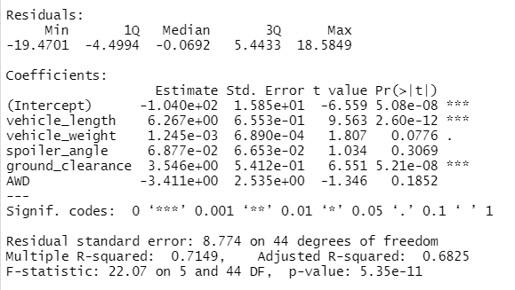
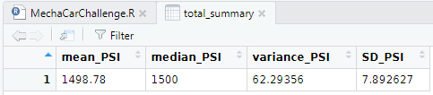
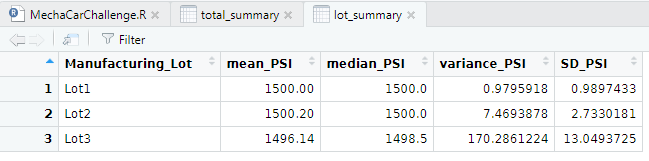
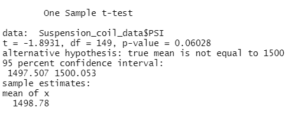
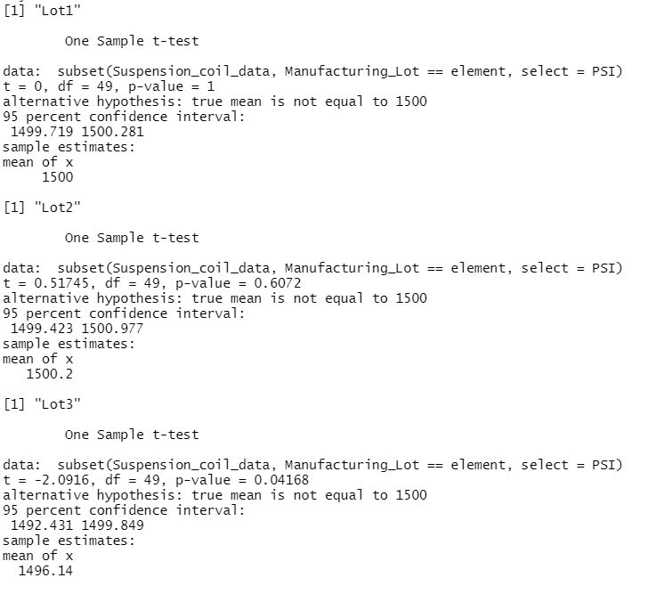

# MechaCar_Statistical_Analysis  
  
The project goal is to evaluate data from the MechaCar prototype.  THe analysis is divided into 3 sections.  
1. Create a linear model for fuel economy using vehicle length, vehicle weight, spoiler angle, ground clearance, and if it has all wheel drive or not.  

2. Calculate the mean, median, variance, and standard deviation of pressures for 3 manufacturing lots of suspension coils.  
  
3. Perform T-tests to determine is the means for the 3 lots of suspension coils are statistically different than the population mean of 1,500 psi.  
  
## Linear Regression to Predict MPG  

  
  
The null hypothesis for the regression analysis is that the variability in the MechaCar fuel economy (MPG) is entirely related to random variability in the other variables.  The alternate hypothesis is that there is a relationship between the independent variables and fuel economy.  The considence level for rejecting the null hypothesis is 0.05.  
  
The null hypothesis can only be rejected if the p value is less than the confidence limit.  
  
Questions:    
1. Vehicle length and ground clearance are the only variables that provide a non-random amount of variance in the fuel economy.  

Interestingly, the intercept is also statistically significant (null hypothesis can be rejected).  This suggests that there are other variables not included in this dataset that contribute to non-random variance in the fuel economy.  
  
2. The slope of the linear model is not considered to be zero.  A zero slope indicates that there is no relationship between the independent and dependent variables.  The total p value is less than 0.05 so the slope cannot be zero.  
  
3. The linear regression model fits the relationship in the training data set.  The r-squared value indicates that the regression is good and the low p value indicate that the regression is statistically significant (null hypothesis is rejected).  As such, the regression model appears to accurately predict fuel economy.  
To truly determine that the model is not overfit the analysis should be performed on a training set and tested on a test set (each a random portion of the total data set).
  
## Summary Statistics on Suspension Coils  
  
The suspension coil data set contains pressure measurements of 150 coils from 3 manufacturing lots.  The population mean pressure is 1,500 psi.  

The measures of central tendency for the data set (without grouping by lot) are displayed below.  
  
  
The measures of central tendency for the data grouped by manufacturing lot are below.  
  
  
Question:  
  
Taken as a group the total suspension coil data do meet the requitement that variance be less than 100 psi.  
However, when grouped by manufacture log it is evident that Lot # 3 does not meet the 100 psi variabce threshold.  
  
# T-Tests on Suspension Coils  
  
T-tests compare the mean of a sample to the mean of a population.  In this case, the null hypothesis is that differences between the mean of the suspension coil pressures and the population are random.  The alternate hypothesis is that the differences between the sample lots and the population mean are not random.  The confidence level is 0.05.
  
  
  
The p-value of the t-test of the total data set and the population mean of 1,500 psi is 0.06.  The null hypothesis cannot be rejected.  The difference between the total data set and the population mean is random.  
  
  
  
The t-tests by lot show that manufacture the null hypothesis can be rejected for lot # 3 (p-value = 0.041).  There was a problem with Lot 3 that should be identified.  
  
# Study Design:  MechaCar vs Competition.  

Determining how the MechaCar compares to competitors can help to set design goals and to design a marketing campaign.  For most drivers, reliability and affordability to opperate are the most critical criteria to judge a car.  The analysis will use data for city and highway fuel economy to gauge affordability and the number of repairs per mile driven to gauge reliability.  
  
Analysis details:  
1. Use city and highway fuel economy and the number of reported repairs.  Data have to be sampled for analogous time periods.  The time period will be determind by the data available for MechaCar.  Tests will be performed on the calculated average per car.  
2. Null hypotheses are that any differences in the mean city fuel economy, highway economy, and number of repairs (over the selected time period) are random at the 95% confidence limit.  
3. The alternative hypotheses are that the mean fuel economy and number of repairs for MechaCar are statistically different than the competitors (p-value of t-test < 0.05) at the 95% confidence level. 
4. T-tests will be performed on the means of fuel economy and number of repairs for MechaCar and its competitors.  The t-tests are ideal to understand if the differences in central tendency of multiple datasets are statistically different or not.  
5. The tests will require a list of the competitor group for MechaCar, the EPA fuel economy data (city and highway) for the competitor group cars, and data on the number of repairs in the first year for the competitor group.  That data might be hard to obtain but it could be sourced from Consumer Reports or a similar watch dog group.  
